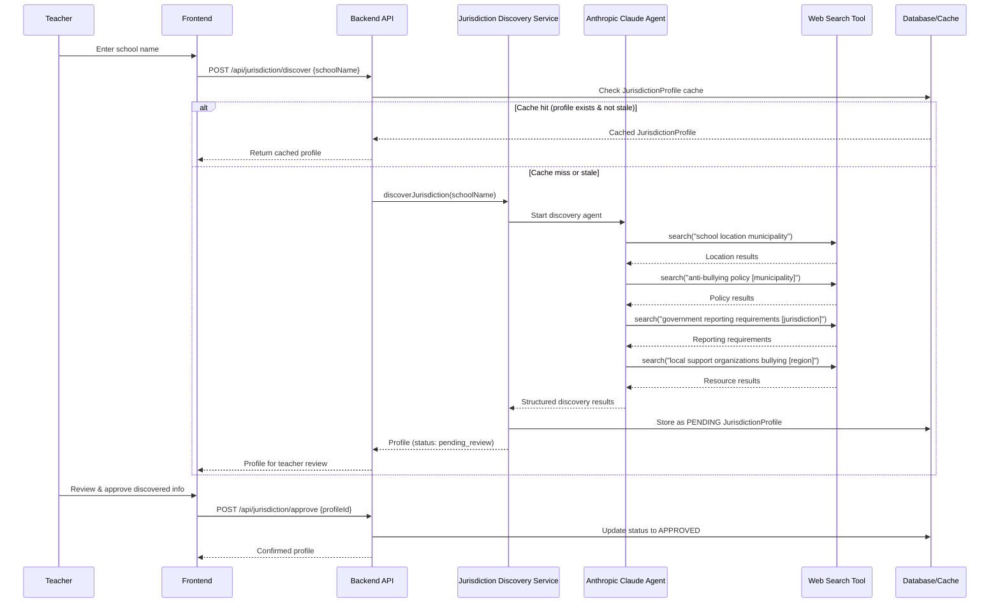
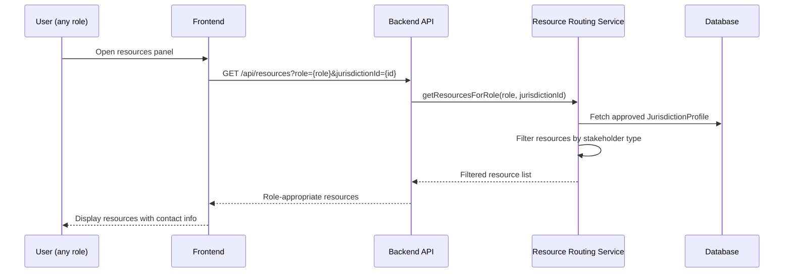
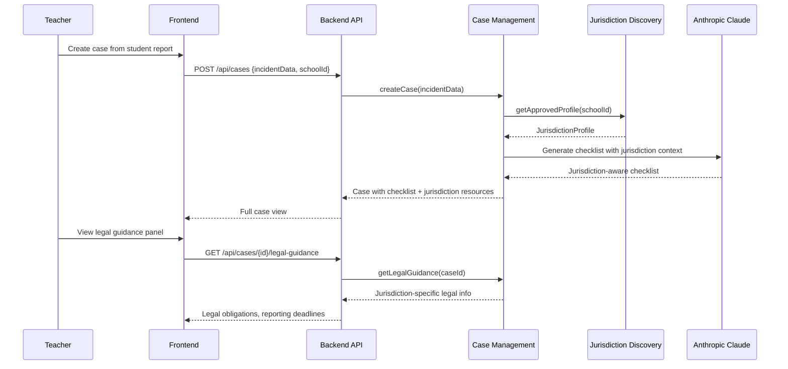

# Design Document: SchoolGuard MVP — Jurisdiction-Aware Resource Discovery

## Overview

SchoolGuard is a hackathon MVP that helps teachers manage bullying cases with **jurisdiction-aware resource discovery** as its hero feature. A teacher enters a school name, and the system uses an AI agent (Anthropic tool-use with web search) to discover anti-bullying resources, legal procedures, and government reporting requirements specific to that school's jurisdiction.

The system follows a local-first development approach (phase 1) with cloud deployment as phase 2. The AI agent performs runtime web searches to build a `JurisdictionProfile` — a cached collection of local resources, legal obligations, and reporting procedures. Teachers review and approve discovered information before it enters the system's knowledge base.

The demo flow: **Enter school name → AI discovers jurisdiction → Teacher reviews/approves → System shows role-specific resources for handling bullying cases.**

## Architecture

```mermaid
graph TD
    subgraph "Frontend (React + Vite + TypeScript)"
        UI[SchoolGuard UI]
        SD[School Discovery Form]
        TD[Teacher Dashboard]
        RV[Resource Viewer]
        CL[Case Lifecycle]
        HL[AI Helpline Chat]
    end

    subgraph "Backend (Node.js + Express)"
        API[REST API]
        JDS[Jurisdiction Discovery Service]
        CMS[Case Management Service]
        RRS[Resource Routing Service]
    end

    subgraph "AI Layer (Anthropic Claude)"
        AG[Discovery Agent]
        WS[Web Search Tool]
        HP[Helpline Agent]
    end

    subgraph "Data Layer"
        DB[(SQLite / Postgres)]
        CACHE[JurisdictionProfile Cache]
    end

    UI --> API
    SD --> API
    TD --> API
    RV --> API
    CL --> API
    HL --> API

    API --> JDS
    API --> CMS
    API --> RRS

    JDS --> AG
    AG --> WS
    HP --> AG

    JDS --> CACHE
    CMS --> DB
    RRS --> CACHE
    RRS --> DB
end
```

## Sequence Diagrams

### Primary Flow: Jurisdiction Discovery



### Secondary Flow: Resource Routing by Stakeholder



### Tertiary Flow: Case with Jurisdiction Context



## Components and Interfaces

### Component 1: Jurisdiction Discovery Service

**Purpose**: Orchestrates the AI agent to discover jurisdiction-specific anti-bullying resources, legal requirements, and reporting procedures for a given school.

```typescript
interface IJurisdictionDiscoveryService {
  discoverJurisdiction(schoolName: string): Promise<JurisdictionProfile>
  getProfile(profileId: string): Promise<JurisdictionProfile | null>
  getApprovedProfile(schoolId: string): Promise<JurisdictionProfile | null>
  approveProfile(profileId: string, teacherId: string): Promise<JurisdictionProfile>
  rejectProfile(profileId: string, teacherId: string, reason: string): Promise<void>
  refreshProfile(profileId: string): Promise<JurisdictionProfile>
}
```

**Responsibilities**:
- Invoke Anthropic Claude with web search tool to discover jurisdiction info
- Parse and structure raw search results into a JurisdictionProfile
- Manage profile lifecycle (pending → approved/rejected)
- Handle cache invalidation and staleness checks
- Seed known Dutch resources (Kindertelefoon, Meldknop.nl, etc.) as baseline

### Component 2: Resource Routing Service

**Purpose**: Filters and routes discovered resources to the appropriate stakeholder type (teacher, student, parent).

```typescript
interface IResourceRoutingService {
  getResourcesForRole(
    role: StakeholderRole,
    jurisdictionId: string
  ): Promise<RoutedResource[]>
  getResourcesByCategory(
    category: ResourceCategory,
    jurisdictionId: string
  ): Promise<RoutedResource[]>
  getAllResources(jurisdictionId: string): Promise<RoutedResource[]>
}
```

**Responsibilities**:
- Map resources to stakeholder roles based on target audience
- Prioritize resources by relevance to the current context
- Provide contact information and action URLs
- Handle the known Dutch resource mappings (role → resource)

### Component 3: Case Management Service

**Purpose**: Manages the bullying case lifecycle, integrating jurisdiction context into checklists and legal guidance.

```typescript
interface ICaseManagementService {
  createCase(data: CreateCaseInput): Promise<Case>
  updateStage(caseId: string, stage: CaseStage): Promise<Case>
  getCase(caseId: string): Promise<Case>
  getCasesForTeacher(teacherId: string): Promise<Case[]>
  generateChecklist(caseId: string): Promise<ChecklistItem[]>
  getLegalGuidance(caseId: string): Promise<LegalGuidance>
  escalateToAuthorities(caseId: string): Promise<EscalationResult>
}
```

**Responsibilities**:
- CRUD operations on cases with lifecycle stage management
- Link cases to jurisdiction profiles for context-aware AI generation
- Generate jurisdiction-aware checklists via AI
- Surface legal guidance from the approved jurisdiction profile
- Draft authority reports using jurisdiction-specific templates

### Component 4: AI Agent (Anthropic Tool-Use)

**Purpose**: The core discovery engine that uses Anthropic's tool-use API with a web search tool to find jurisdiction-specific information at runtime.

```typescript
interface IAIAgent {
  discover(query: DiscoveryQuery): Promise<DiscoveryResult>
  chat(messages: ChatMessage[], context: AgentContext): Promise<ChatResponse>
  generateChecklist(caseContext: CaseContext): Promise<ChecklistItem[]>
  draftReport(caseContext: CaseContext, template: ReportTemplate): Promise<string>
}

interface DiscoveryQuery {
  schoolName: string
  searchGoals: SearchGoal[]
}

type SearchGoal =
  | 'locate_school'
  | 'find_municipality'
  | 'discover_anti_bullying_policy'
  | 'find_reporting_requirements'
  | 'find_local_resources'
  | 'find_legal_obligations'
```

**Responsibilities**:
- Execute multi-step web searches using Anthropic tool-use
- Structure raw search results into typed data
- Maintain search context across multiple tool calls
- Provide confidence scores for discovered information
- Fall back gracefully when searches yield no results

### Component 5: Frontend — School Discovery Form

**Purpose**: Entry point for the demo. Teacher enters a school name and triggers jurisdiction discovery.

```typescript
interface SchoolDiscoveryFormProps {
  onDiscoveryComplete: (profile: JurisdictionProfile) => void
  onError: (error: DiscoveryError) => void
}

interface JurisdictionReviewPanelProps {
  profile: JurisdictionProfile
  onApprove: (profileId: string) => void
  onReject: (profileId: string, reason: string) => void
  onEditResource: (resourceId: string, edits: Partial<DiscoveredResource>) => void
}
```

**Responsibilities**:
- Collect school name input with autocomplete suggestions
- Show discovery progress (searching... found location... finding resources...)
- Present discovered profile for teacher review
- Allow teacher to approve, reject, or edit individual resources

## Data Models

### JurisdictionProfile

```typescript
interface JurisdictionProfile {
  id: string
  schoolName: string
  schoolAddress?: string
  municipality: string
  province?: string
  country: string
  status: ProfileStatus
  discoveredAt: Date
  approvedAt?: Date
  approvedBy?: string
  expiresAt: Date // cache TTL
  resources: DiscoveredResource[]
  legalObligations: LegalObligation[]
  reportingProcedures: ReportingProcedure[]
  confidenceScore: number // 0-1, how confident the AI is in results
}

type ProfileStatus = 'discovering' | 'pending_review' | 'approved' | 'rejected' | 'stale'
```

**Validation Rules**:
- `schoolName` must be non-empty
- `municipality` must be resolved before resources can be discovered
- `status` transitions: discovering → pending_review → approved/rejected; approved → stale (on expiry)
- `expiresAt` defaults to 30 days from discovery
- `confidenceScore` below 0.5 triggers a warning in the review UI

### DiscoveredResource

```typescript
interface DiscoveredResource {
  id: string
  profileId: string
  name: string
  description: string
  url?: string
  phone?: string
  email?: string
  targetAudience: StakeholderRole[]
  category: ResourceCategory
  source: string // where the AI found this
  confidence: number // 0-1
  isKnownResource: boolean // true for pre-seeded Dutch resources
  verifiedByTeacher: boolean
}

type StakeholderRole = 'student' | 'parent' | 'teacher' | 'coordinator'

type ResourceCategory =
  | 'helpline'
  | 'reporting_portal'
  | 'support_organization'
  | 'government_body'
  | 'school_internal'
  | 'legal_aid'
  | 'counseling'
```

**Known Dutch Resources (Pre-seeded)**:
| Resource | Target Audience | Category |
|----------|----------------|----------|
| Kindertelefoon (0800-0432) | student | helpline |
| Meldknop.nl | student, parent | reporting_portal |
| Stichting School & Veiligheid | teacher | support_organization |
| Stop Pesten NU Teacher Portal | teacher | support_organization |
| stoppestennu.nl | parent | support_organization |
| School Anti-Bullying Coordinator | teacher, coordinator | school_internal |

### LegalObligation

```typescript
interface LegalObligation {
  id: string
  profileId: string
  title: string
  description: string
  authority: string // which body enforces this
  deadline?: string // e.g., "within 24 hours", "within 5 school days"
  sourceUrl?: string
  applicableLaw?: string // e.g., "Wet veiligheid op school"
  confidence: number
}
```

### ReportingProcedure

```typescript
interface ReportingProcedure {
  id: string
  profileId: string
  title: string
  steps: ProcedureStep[]
  targetAuthority: string
  requiredDocuments?: string[]
  templateAvailable: boolean
  sourceUrl?: string
  confidence: number
}

interface ProcedureStep {
  order: number
  description: string
  responsible: StakeholderRole
  deadline?: string
}
```

### Case (Updated)

```typescript
interface Case {
  id: string
  teacherId: string
  studentId?: string // nullable for anonymous reports
  jurisdictionProfileId: string // REQUIRED — links to discovered profile
  status: CaseStage
  priority: CasePriority
  incidentType: string
  description: string
  checklist: ChecklistItem[]
  createdAt: Date
  updatedAt: Date
}

type CaseStage = 'report' | 'triage' | 'review' | 'action' | 'resolve'
type CasePriority = 'critical' | 'high' | 'medium' | 'low'

interface ChecklistItem {
  id: string
  caseId: string
  text: string
  done: boolean
  order: number
  jurisdictionSpecific: boolean // true if derived from jurisdiction profile
}

interface LegalGuidance {
  obligations: LegalObligation[]
  procedures: ReportingProcedure[]
  resources: DiscoveredResource[]
  generatedAt: Date
}
```

## Algorithmic Pseudocode

### Algorithm 1: Jurisdiction Discovery via AI Agent

```typescript
async function discoverJurisdiction(schoolName: string): Promise<JurisdictionProfile> {
  // Step 1: Check cache
  const cached = await cache.getBySchoolName(schoolName)
  if (cached && cached.status === 'approved' && !isStale(cached)) {
    return cached
  }

  // Step 2: Create pending profile
  const profile = await db.createProfile({
    schoolName,
    status: 'discovering',
    discoveredAt: new Date(),
    expiresAt: addDays(new Date(), 30),
    resources: [],
    legalObligations: [],
    reportingProcedures: [],
    confidenceScore: 0
  })

  // Step 3: Run AI agent with web search tool
  const discoveryResult = await anthropic.messages.create({
    model: 'claude-sonnet-4-20250514',
    max_tokens: 4096,
    tools: [webSearchTool],
    system: JURISDICTION_DISCOVERY_SYSTEM_PROMPT,
    messages: [{
      role: 'user',
      content: `Discover anti-bullying resources and reporting requirements for: ${schoolName}`
    }]
  })

  // Step 4: Process tool-use results through agentic loop
  const structuredResults = await processAgentLoop(discoveryResult)

  // Step 5: Merge with known resources
  const mergedResources = mergeWithKnownResources(
    structuredResults.resources,
    getKnownResourcesForCountry(structuredResults.country)
  )

  // Step 6: Update profile
  const updatedProfile = await db.updateProfile(profile.id, {
    municipality: structuredResults.municipality,
    province: structuredResults.province,
    country: structuredResults.country,
    status: 'pending_review',
    resources: mergedResources,
    legalObligations: structuredResults.legalObligations,
    reportingProcedures: structuredResults.reportingProcedures,
    confidenceScore: structuredResults.overallConfidence
  })

  return updatedProfile
}
```

**Preconditions:**
- `schoolName` is a non-empty string
- Anthropic API key is configured and valid
- Web search tool is registered with the AI agent

**Postconditions:**
- Returns a `JurisdictionProfile` with status `'pending_review'` or `'approved'` (if cached)
- Profile contains at least the municipality and country fields populated
- All discovered resources have a confidence score between 0 and 1
- Known resources for the detected country are always included regardless of search results

**Loop Invariants:**
- During the agent loop: each iteration either produces a tool result or terminates
- The agent loop terminates when the model returns a `stop` or `end_turn` stop reason
- Accumulated resources never decrease in count across iterations

### Algorithm 2: AI Agent Loop (Anthropic Tool-Use)

```typescript
async function processAgentLoop(
  initialResponse: AnthropicMessage
): Promise<StructuredDiscoveryResult> {
  let messages: Message[] = []
  let currentResponse = initialResponse
  const allToolResults: ToolResult[] = []

  // Agentic loop: keep processing until agent stops calling tools
  while (currentResponse.stop_reason === 'tool_use') {
    const toolUseBlocks = currentResponse.content.filter(
      block => block.type === 'tool_use'
    )

    // Execute each tool call
    const toolResults = await Promise.all(
      toolUseBlocks.map(async (toolCall) => {
        if (toolCall.name === 'web_search') {
          const searchResult = await executeWebSearch(toolCall.input.query)
          return { tool_use_id: toolCall.id, content: searchResult }
        }
        throw new Error(`Unknown tool: ${toolCall.name}`)
      })
    )

    allToolResults.push(...toolResults)

    // Continue conversation with tool results
    messages.push(
      { role: 'assistant', content: currentResponse.content },
      { role: 'user', content: toolResults.map(r => ({
        type: 'tool_result',
        tool_use_id: r.tool_use_id,
        content: r.content
      }))}
    )

    currentResponse = await anthropic.messages.create({
      model: 'claude-sonnet-4-20250514',
      max_tokens: 4096,
      tools: [webSearchTool],
      system: JURISDICTION_DISCOVERY_SYSTEM_PROMPT,
      messages
    })
  }

  // Parse final text response into structured data
  return parseDiscoveryResponse(currentResponse.content)
}
```

**Preconditions:**
- `initialResponse` is a valid Anthropic API response
- Web search tool is available and functional

**Postconditions:**
- Returns structured discovery results with all fields populated (possibly empty arrays)
- All tool calls have been resolved
- The loop has terminated (no pending tool calls)

**Loop Invariants:**
- `messages` array grows by exactly 2 entries per iteration (assistant + user/tool_result)
- `allToolResults` accumulates all tool results across iterations
- Each iteration reduces remaining search goals (agent converges toward completion)

### Algorithm 3: Resource Routing by Stakeholder Role

```typescript
function getResourcesForRole(
  role: StakeholderRole,
  profile: JurisdictionProfile
): RoutedResource[] {
  // Filter resources that target this role
  const matched = profile.resources.filter(
    resource => resource.targetAudience.includes(role) && resource.verifiedByTeacher
  )

  // Sort by: known resources first, then by confidence score
  const sorted = matched.sort((a, b) => {
    if (a.isKnownResource && !b.isKnownResource) return -1
    if (!a.isKnownResource && b.isKnownResource) return 1
    return b.confidence - a.confidence
  })

  // Map to routed format with action context
  return sorted.map(resource => ({
    ...resource,
    actionLabel: getActionLabel(resource.category),
    actionUrl: resource.url || resource.phone
      ? `tel:${resource.phone}`
      : undefined,
    contextNote: generateContextNote(resource, role)
  }))
}

function getActionLabel(category: ResourceCategory): string {
  const labels: Record<ResourceCategory, string> = {
    helpline: 'Bel nu',
    reporting_portal: 'Meld hier',
    support_organization: 'Bekijk info',
    government_body: 'Contact',
    school_internal: 'Intern contact',
    legal_aid: 'Juridisch advies',
    counseling: 'Maak afspraak'
  }
  return labels[category]
}
```

**Preconditions:**
- `role` is a valid `StakeholderRole`
- `profile` has status `'approved'`
- `profile.resources` contains only teacher-verified resources

**Postconditions:**
- Returns only resources where `targetAudience` includes the given role
- Results are sorted: known resources first, then by descending confidence
- All returned resources have `verifiedByTeacher === true`
- Empty array is valid (no resources found for this role)

### Algorithm 4: Known Resource Seeding

```typescript
function mergeWithKnownResources(
  discovered: DiscoveredResource[],
  knownResources: KnownResource[]
): DiscoveredResource[] {
  const merged = [...discovered]

  for (const known of knownResources) {
    // Check if AI already discovered this resource
    const alreadyFound = discovered.find(d =>
      d.name.toLowerCase().includes(known.matchKey.toLowerCase()) ||
      (d.url && d.url.includes(known.urlFragment))
    )

    if (alreadyFound) {
      // Enrich existing entry with known data
      alreadyFound.isKnownResource = true
      alreadyFound.confidence = Math.max(alreadyFound.confidence, 0.95)
      alreadyFound.phone = alreadyFound.phone || known.phone
      alreadyFound.url = alreadyFound.url || known.url
    } else {
      // Add known resource that AI missed
      merged.push({
        id: generateId(),
        profileId: '', // set by caller
        name: known.name,
        description: known.description,
        url: known.url,
        phone: known.phone,
        email: known.email,
        targetAudience: known.targetAudience,
        category: known.category,
        source: 'pre-seeded (known Dutch resource)',
        confidence: 0.99,
        isKnownResource: true,
        verifiedByTeacher: false // still needs teacher approval
      })
    }
  }

  return merged
}
```

**Preconditions:**
- `discovered` is the raw output from the AI agent (may be empty)
- `knownResources` is the pre-configured list for the detected country

**Postconditions:**
- All known resources appear in the output (either merged with discovered or added)
- Known resources have `isKnownResource === true`
- Known resources have confidence ≥ 0.95
- Original discovered resources are preserved (never removed)
- Duplicate detection uses fuzzy name matching and URL fragment matching

### Algorithm 5: Cache Staleness Check

```typescript
function isStale(profile: JurisdictionProfile): boolean {
  return new Date() > profile.expiresAt
}

function shouldRefresh(profile: JurisdictionProfile): boolean {
  // Refresh if stale OR if confidence is low and older than 7 days
  if (isStale(profile)) return true
  if (profile.confidenceScore < 0.6) {
    const sevenDaysAgo = addDays(new Date(), -7)
    return profile.discoveredAt < sevenDaysAgo
  }
  return false
}
```

**Preconditions:**
- `profile` is a valid `JurisdictionProfile` from the database

**Postconditions:**
- `isStale` returns true if and only if current time exceeds `expiresAt`
- `shouldRefresh` returns true if stale OR (low confidence AND older than 7 days)
- No side effects — pure functions

## Key Functions with Formal Specifications

### Function: discoverJurisdiction()

```typescript
async function discoverJurisdiction(schoolName: string): Promise<JurisdictionProfile>
```

**Preconditions:**
- `schoolName.trim().length > 0`
- Environment variable `ANTHROPIC_API_KEY` is set
- Database connection is active

**Postconditions:**
- Returns profile with `status ∈ {'pending_review', 'approved'}`
- `profile.municipality` is non-empty string
- `profile.resources.length >= knownResources.length` (known resources always included)
- Profile is persisted in database
- If cache hit: no API calls made, returns within 50ms

### Function: approveProfile()

```typescript
async function approveProfile(profileId: string, teacherId: string): Promise<JurisdictionProfile>
```

**Preconditions:**
- Profile with `profileId` exists in database
- Profile has `status === 'pending_review'`
- `teacherId` corresponds to a valid teacher user

**Postconditions:**
- Profile `status` is updated to `'approved'`
- `approvedAt` is set to current timestamp
- `approvedBy` is set to `teacherId`
- All resources in profile have `verifiedByTeacher` set to `true`
- Profile is now available for case management use

### Function: getResourcesForRole()

```typescript
function getResourcesForRole(role: StakeholderRole, jurisdictionId: string): Promise<RoutedResource[]>
```

**Preconditions:**
- `role ∈ {'student', 'parent', 'teacher', 'coordinator'}`
- Profile with `jurisdictionId` exists and has `status === 'approved'`

**Postconditions:**
- All returned resources have `targetAudience.includes(role)`
- Results sorted by: `isKnownResource` desc, then `confidence` desc
- All returned resources have `verifiedByTeacher === true`
- Result is deterministic for same inputs (no randomness)

## Example Usage

### Example 1: Demo Flow — Discover Jurisdiction for a Dutch School

```typescript
// Teacher enters school name in the discovery form
const profile = await jurisdictionService.discoverJurisdiction(
  "Basisschool De Regenboog, Amsterdam"
)

// Profile comes back with status 'pending_review'
console.log(profile.municipality)  // "Amsterdam"
console.log(profile.country)       // "Netherlands"
console.log(profile.resources)     // [Kindertelefoon, Meldknop.nl, ...]
console.log(profile.legalObligations) // [Wet veiligheid op school, ...]
console.log(profile.confidenceScore)  // 0.82

// Teacher reviews and approves
const approved = await jurisdictionService.approveProfile(profile.id, teacher.id)
console.log(approved.status)  // "approved"
```

### Example 2: Resource Routing for Different Stakeholders

```typescript
// Teacher sees teacher-specific resources
const teacherResources = await resourceService.getResourcesForRole(
  'teacher', approved.id
)
// → [Stichting School & Veiligheid, Stop Pesten NU Teacher Portal, Coordinator]

// Student sees student-specific resources
const studentResources = await resourceService.getResourcesForRole(
  'student', approved.id
)
// → [Kindertelefoon, Meldknop.nl]

// Parent sees parent-specific resources
const parentResources = await resourceService.getResourcesForRole(
  'parent', approved.id
)
// → [Meldknop.nl, stoppestennu.nl]
```

### Example 3: Case Creation with Jurisdiction Context

```typescript
// Student submits a report
const newCase = await caseService.createCase({
  teacherId: teacher.id,
  studentId: student.id,
  jurisdictionProfileId: approved.id,
  incidentType: 'verbal_bullying',
  description: 'Student reports repeated name-calling during recess'
})

// Case automatically gets jurisdiction-aware checklist
console.log(newCase.checklist)
// [
//   { text: "Voer gesprek met betrokken leerling", jurisdictionSpecific: false },
//   { text: "Informeer anti-pestcoördinator (verplicht binnen 24u)", jurisdictionSpecific: true },
//   { text: "Registreer in SISA indien ernstig (Amsterdam)", jurisdictionSpecific: true },
//   { text: "Informeer ouders binnen 5 schooldagen", jurisdictionSpecific: true },
// ]

// Teacher views legal guidance
const guidance = await caseService.getLegalGuidance(newCase.id)
console.log(guidance.obligations[0].applicableLaw)
// "Wet veiligheid op school (2015)"
```

### Example 4: AI Agent Web Search Tool Definition

```typescript
const webSearchTool = {
  name: 'web_search',
  description: 'Search the web for current information about anti-bullying policies, local resources, and reporting requirements.',
  input_schema: {
    type: 'object',
    properties: {
      query: {
        type: 'string',
        description: 'The search query to find jurisdiction-specific information'
      }
    },
    required: ['query']
  }
}

const JURISDICTION_DISCOVERY_SYSTEM_PROMPT = `You are a research agent that discovers anti-bullying resources and reporting requirements for schools.

Given a school name, you must:
1. Determine the school's location (municipality, province, country)
2. Find local anti-bullying policies and procedures
3. Identify government reporting requirements and deadlines
4. Discover local support organizations for students, parents, and teachers
5. Find relevant laws and legal obligations

Use the web_search tool to find current, accurate information. Make multiple searches to build a complete picture. Structure your final response as JSON with the following fields:
- municipality, province, country
- resources: [{name, description, url, phone, targetAudience, category}]
- legalObligations: [{title, description, authority, deadline, applicableLaw}]
- reportingProcedures: [{title, steps, targetAuthority, requiredDocuments}]
- overallConfidence: number between 0 and 1`
```

## Correctness Properties

*A property is a characteristic or behavior that should hold true across all valid executions of a system — essentially, a formal statement about what the system should do. Properties serve as the bridge between human-readable specifications and machine-verifiable correctness guarantees.*

### Property 1: Known resources always present

*For any* JurisdictionProfile where the detected country is "Netherlands" and status is "pending_review" or "approved", all known Dutch resources (Kindertelefoon, Meldknop.nl, Stichting School & Veiligheid, Stop Pesten NU, stoppestennu.nl) SHALL appear in the profile's resources list, regardless of whether the AI agent discovered them independently or experienced failures.

**Validates: Requirements 2.1, 2.3, 9.4**

### Property 2: Merge preserves discovered resources

*For any* set of AI-discovered resources and any set of known resources, the merged output SHALL be a superset of the original discovered resources — merging never removes or overwrites AI-discovered entries.

**Validates: Requirements 2.4**

### Property 3: Known resource confidence floor

*For any* known pre-seeded resource in a JurisdictionProfile, the confidence score SHALL be at least 0.95. When a known resource is merged with an AI-discovered duplicate, the resulting confidence SHALL be the maximum of the discovered confidence and 0.95.

**Validates: Requirements 2.2, 7.5**

### Property 4: Resource routing correctness

*For any* role and jurisdiction profile, all resources returned by the Resource_Routing_Service SHALL satisfy: (a) the role is included in the resource's targetAudience, (b) verifiedByTeacher equals true, and (c) the profile has status "approved". If the profile is not approved, the service returns an empty list.

**Validates: Requirements 3.1, 3.3, 4.4**

### Property 5: Resource routing sort order

*For any* list of resources returned by the Resource_Routing_Service, known resources (isKnownResource = true) SHALL appear before non-known resources, and within each group resources SHALL be ordered by descending confidence score.

**Validates: Requirements 3.2**

### Property 6: Profile status transitions

*For any* attempted status transition on a JurisdictionProfile, only the following transitions SHALL succeed: discovering → pending_review, pending_review → approved, pending_review → rejected, approved → stale. All other transitions SHALL be rejected with an error.

**Validates: Requirements 8.1, 8.2, 1.2**

### Property 7: Confidence score bounds

*For any* DiscoveredResource, the confidence field SHALL be in the range [0, 1]. *For any* JurisdictionProfile, the confidenceScore field SHALL be in the range [0, 1].

**Validates: Requirements 7.1, 7.2**

### Property 8: Teacher approval postconditions

*For any* JurisdictionProfile that is approved by a teacher, the resulting profile SHALL have: status = "approved", approvedAt set to a valid timestamp, approvedBy set to the teacher's ID, and all resources marked with verifiedByTeacher = true. *For any* profile that is rejected, the resulting profile SHALL have: status = "rejected" and a non-empty rejection reason recorded.

**Validates: Requirements 4.2, 4.3**

### Property 9: Case-jurisdiction linkage

*For any* case creation attempt, the Case_Management_Service SHALL reject the operation if the referenced JurisdictionProfile does not exist or does not have status "approved". All successfully created cases SHALL reference an existing, approved profile.

**Validates: Requirements 6.1**

### Property 10: Cache staleness correctness

*For any* JurisdictionProfile, isStale() SHALL return true if and only if the current time exceeds the profile's expiresAt date. The expiresAt date SHALL always equal discoveredAt + 30 days. shouldRefresh() SHALL return true if the profile is stale OR (confidenceScore < 0.6 AND age > 7 days).

**Validates: Requirements 5.1, 5.2, 5.5**

### Property 11: Profile edit preserves unmodified data

*For any* edit to a single resource within a JurisdictionProfile during teacher review, all other resources in the profile and all non-resource profile fields SHALL remain unchanged.

**Validates: Requirements 4.5**

### Property 12: Case stage audit trail

*For any* case stage transition, the Case_Management_Service SHALL create an audit log entry containing: the previous stage, the new stage, a timestamp, and the ID of the teacher who performed the transition.

**Validates: Requirements 6.5**

### Property 13: Legal guidance from linked profile

*For any* case with a linked JurisdictionProfile, requesting legal guidance SHALL return the legal obligations and reporting procedures from that specific linked profile — not from any other profile or generated content.

**Validates: Requirements 6.3**

## Error Handling

### Error Scenario 1: AI Agent Search Failure

**Condition**: Anthropic API returns an error or web search tool fails
**Response**: Return partial profile with whatever was discovered so far; set `confidenceScore` to 0.3; add a `discoveryNote` explaining what failed
**Recovery**: Teacher can trigger a manual refresh; known resources are still seeded regardless of API failure

### Error Scenario 2: School Not Found

**Condition**: AI agent cannot determine the school's location from the given name
**Response**: Return profile with `status: 'pending_review'`, empty municipality, `confidenceScore: 0.1`; UI prompts teacher to manually enter municipality
**Recovery**: Teacher manually provides municipality → system re-runs discovery with explicit location

### Error Scenario 3: Stale Profile Used

**Condition**: A case references a profile that has become stale (past `expiresAt`)
**Response**: System continues to serve the stale profile (no disruption) but shows a banner: "Jurisdiction info may be outdated — refresh recommended"
**Recovery**: Teacher triggers refresh; new profile goes through review cycle; existing cases retain old profile until teacher explicitly updates

### Error Scenario 4: Low Confidence Results

**Condition**: `confidenceScore < 0.5` on the overall profile
**Response**: UI shows warning badge on the review panel; resources below 0.4 confidence are visually de-emphasized; teacher is prompted to verify each resource individually
**Recovery**: Teacher can mark individual resources as verified or remove them; overall confidence recalculates based on verified subset

### Error Scenario 5: Rate Limiting on Web Search

**Condition**: Too many discovery requests in a short period exhaust search API limits
**Response**: Queue discovery requests; return `status: 'discovering'` with estimated wait time; UI shows progress indicator
**Recovery**: Queued requests are processed as capacity becomes available; teacher is notified when discovery completes

## Testing Strategy

### Unit Testing Approach

- **Resource routing logic**: Verify correct filtering by role, sorting by confidence, known resource priority
- **Cache staleness**: Test `isStale()` and `shouldRefresh()` with various date scenarios
- **Known resource merging**: Test deduplication, enrichment, and addition of missing known resources
- **Profile status transitions**: Verify only valid transitions are allowed
- **Confidence score calculations**: Verify bounds and aggregation logic

### Property-Based Testing Approach

**Property Test Library**: fast-check (TypeScript)

- **Resource routing invariant**: For any valid role and approved profile, all returned resources contain that role in `targetAudience`
- **Known resource seeding invariant**: For any set of discovered resources and known resources, the merged output always contains all known resources
- **Confidence bounds**: For any generated profile, all confidence scores are in [0, 1]
- **Status transition validity**: For any sequence of status changes, only valid transitions succeed

### Integration Testing Approach

- **Discovery flow end-to-end**: Mock Anthropic API responses; verify full flow from school name input to pending profile
- **Approval flow**: Create pending profile → approve → verify resources become available for case management
- **Case creation with jurisdiction**: Create approved profile → create case → verify checklist includes jurisdiction-specific items
- **Demo flow smoke test**: Full happy path from school name entry to resource display

## Performance Considerations

- **Discovery latency**: AI agent with multiple web searches may take 10-30 seconds. UI must show progress indicators and allow the teacher to continue other work.
- **Cache hit ratio**: For the demo, most schools will be queried once. Cache TTL of 30 days is generous for hackathon scope.
- **Concurrent discoveries**: No need for queue in MVP — single-user demo. But design the interface to support it for phase 2.
- **Database**: SQLite is sufficient for local-first MVP. Profile data is small (< 50KB per profile).

## Security Considerations

- **Teacher approval gate**: No AI-discovered information reaches end users without teacher verification. This prevents hallucinated resources from being presented as real.
- **API key protection**: Anthropic API key stored in environment variable, never exposed to frontend.
- **Input sanitization**: School name input is sanitized before being passed to the AI agent to prevent prompt injection.
- **No PII in searches**: The AI agent searches for institutional/organizational info only, never for individual student or parent data.

## Dependencies

| Dependency | Purpose | Version |
|-----------|---------|---------|
| @anthropic-ai/sdk | AI agent with tool-use for jurisdiction discovery | ^0.30.x |
| React + Vite | Frontend framework | React 18, Vite 5 |
| Express | Backend API server | ^4.18 |
| better-sqlite3 | Local-first database | ^11.x |
| uuid | ID generation | ^9.x |
| zod | Runtime type validation for API responses | ^3.22 |
| fast-check | Property-based testing | ^3.x |
| vitest | Test runner | ^2.x |
